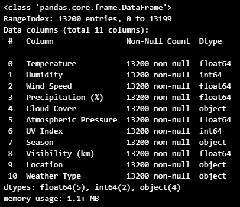
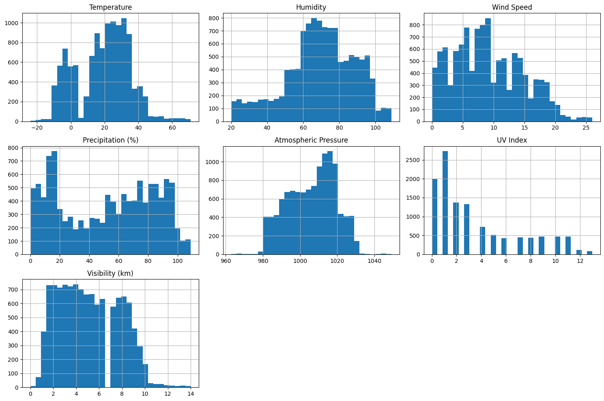
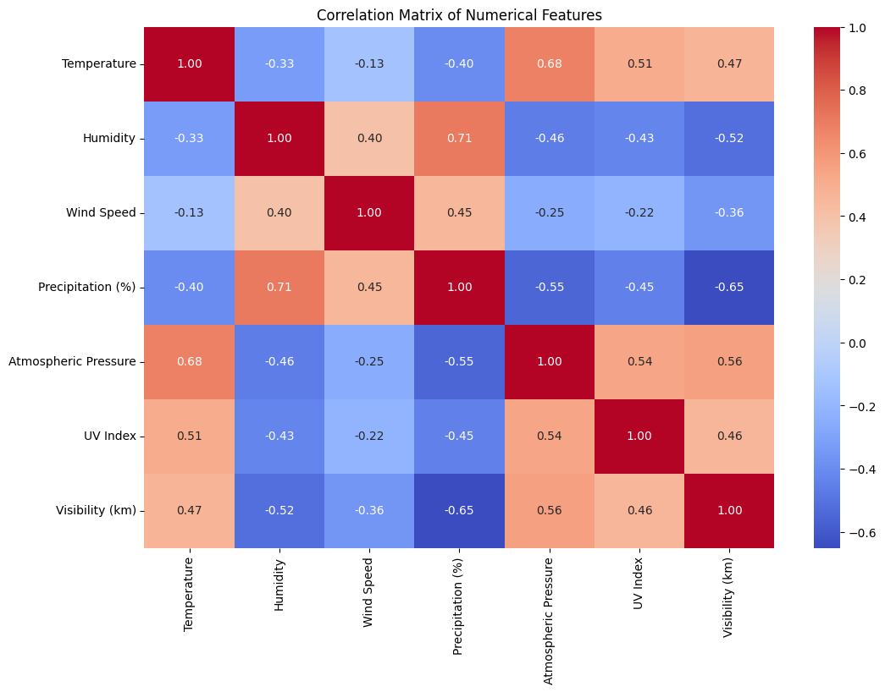

# Laporan Proyek Machine Learning - Andi Wibowo

## Domain Proyek: Lingkungan
### Latar Belakang
Cuaca merupakan aspek penting dalam berbagai sektor kehidupan, seperti pertanian, transportasi, pariwisata, hingga mitigasi bencana. Ketepatan dalam memprediksi cuaca sangat berpengaruh terhadap pengambilan keputusan yang efektif dan efisien. Seiring dengan berkembangnya teknologi, pemanfaatan machine learning dalam sistem prediksi cuaca menjadi semakin krusial. Teknologi ini mampu meningkatkan akurasi dan efisiensi prediksi dengan mengolah data besar dari berbagai sumber seperti satelit, sensor cuaca, dan model iklim global (Fudhlatina & Budiman, 2025).

Sebagai bagian dari kecerdasan buatan, machine learning dapat mengenali pola-pola kompleks dalam data cuaca, serta menemukan hubungan antara berbagai variabel penting seperti suhu, kelembaban, tekanan udara, dan curah hujan. Algoritma yang umum digunakan dalam penelitian prediksi cuaca meliputi Random Forest, K-Nearest Neighbors (KNN), Gradient Boosting, dan Support Vector Machine (SVM), yang masing-masing memiliki kelebihan dan kekurangan tergantung pada konteks dan karakteristik data (Yusuf et al., 2021; Dwiyanti & Prianto, 2023).

Berbagai studi telah membandingkan performa algoritma-algoritma tersebut dalam konteks prediksi cuaca di Indonesia. Hasilnya menunjukkan bahwa model machine learning dapat secara signifikan meningkatkan akurasi prediksi dibandingkan metode konvensional, meskipun pemilihan model terbaik tetap bergantung pada evaluasi metrik yang relevan serta distribusi dan kualitas data yang digunakan (Zulfiani & Fauzi, 2023).

Dengan pendekatan berbasis machine learning, pengembangan sistem prediksi cuaca diharapkan mampu memberikan kontribusi nyata dalam mendukung adaptasi dan mitigasi perubahan iklim secara berkelanjutan.

### Referensi
Dwiyanti, Z. A., & Prianto, C. (2023). Prediksi Cuaca Kota Jakarta Menggunakan Metode Random Forest. Jurnal Tekno Insentif, 17(2), 127–137. [https://doi.org/10.36787/jti.v17i2.1136]

Fudhlatina, D., & Budiman, F. (2025). Edumatic: Jurnal Pendidikan Informatika Peningkatan Akurasi Prediksi Curah Hujan menggunakan Gradient Boosting dan CatBoost dengan Pendekatan Voting Classifier. 9(1), 51–59. [https://doi.org/10.29408/edumatic.v9i1.28988]

Yusuf, M., Rangkuti, R., Alfansyuri, V., Gunawan, W., Informatika, T., Komputer, I., & Mercu Buana, U. (2021). PENERAPAN ALGORITMA K-NEAREST NEIGHBOR (KNN) DALAM MEMPREDIKSI DAN MENGHITUNG TINGKAT AKURASI DATA CUACA DI INDONESIA. 2(2). [https://www.jurnal.uts.ac.id/index.php/hexagon/article/view/1082]

Zulfiani, A., & Fauzi, C. (2023). Penerapan Algorimta Backpropagation Untuk Prakiraan Cuaca Harian Dibandingkan Dengan Support Vector Machine dan Logistic Regression. JURNAL MEDIA INFORMATIKA BUDIDARMA, 7(3), 1229. [https://doi.org/10.30865/mib.v7i3.6173]

## Business Understanding
### Problem Statements
- Bagaimana cara memprediksi jenis cuaca (Sunny, Rainy, dsb.) berdasarkan parameter cuaca lainnya?
- Model machine learning mana yang memberikan performa terbaik dalam prediksi cuaca berdasarkan data observasi?

### Goals
- Menghasilkan model yang mampu mengklasifikasikan cuaca dengan akurat berdasarkan input data lingkungan.
- Menentukan model terbaik berdasarkan evaluasi metrik seperti akurasi, precision, recall, F1-score, dan ROC-AUC.

### Solution statements
- Menggunakan empat algoritma machine learning: 
  - K-Nearest Neighbors (KNN)
  - Random Forest
  - Gradient Boosting
  - Support Vector Machine (SVM)

- Metrik evaluasi utama yang digunakan:
  - Accuracy  
  - Recall  
  - F1-score  
  - Precision 
  - ROC-AUC

- Model dengan performa terbaik akan ditentukan dari kombinasi evaluasi kuantitatif dan confusion matrix.

## Data Understanding
Proyek ini menggunakan dataset Weather Type Classification yang dapat diakses melalui Kaggle pada link berikut [Weather Type Classification](https://www.kaggle.com/datasets/nikhil7280/weather-type-classification).

##  Variabel pada Dataset Prediksi Kualitas Udara

Berikut adalah deskripsi dari masing-masing fitur (variabel) dalam dataset `Weather Type Classification` yang digunakan untuk memprediksi cuaca:

| Variabel                       | Deskripsi                                                                                     |
|------------------------------|-----------------------------------------------------------------------------------------------|
| `Temperature`                | Suhu dalam derajat Celcius, mencakup kondisi dari sangat dingin hingga sangat panas. |
| `Humidity`                   | Persentase kelembaban udara, termasuk nilai ekstrem di atas 100% untuk menunjukkan keberadaan outlier.     |
| `Wind Speed`                 | Kecepatan angin dalam kilometer per jam, dengan rentang termasuk nilai yang tidak realistis sebagai outlier. |
| `Precipitation (%)`          | Persentase curah hujan, juga termasuk nilai outlier. |
| `Cloud Cover `               | Deskripsi kondisi tutupan awan (misal: clear, cloudy). |
| `Atmospheric Pressure`       | Tekanan atmosfer dalam satuan hPa, mencakup berbagai variasi tekanan.         |
| `UV Index`                   | Indeks UV yang menunjukkan kekuatan radiasi ultraviolet. |
| `Season`                     | Musim saat data dicatat (Spring, Summer, Autumn, Winter)        |
| `Visibility`                 |  Jarak pandang dalam kilometer, termasuk nilai sangat rendah maupun tinggi. |
| `Location`                   | Jenis lokasi tempat pengamatan dilakukan (misal: inland, coastal, mountain).    |
| `Weather Type `              |  Variabel target untuk klasifikasi, menunjukkan jenis cuaca seperti Sunny, Rainy, Cloudy, dsb.    |

## Data cleaning
  Pembersihan data dilakukan untuk menghapus outlier pada fitur numerik yang dapat mempengaruhi performa model. Metode yang digunakan adalah IQR (Interquartile Range), yang menghilangkan nilai-nilai ekstrem di bawah Q1 - 1.5IQR dan di atas Q3 + 1.5IQR.
```python
df_cleaned = df.copy()

numerical_cols = df_cleaned.select_dtypes(include=np.number).columns

for col in numerical_cols:
    Q1 = df_cleaned[col].quantile(0.25)
    Q3 = df_cleaned[col].quantile(0.75)
    IQR = Q3 - Q1
    lower_bound = Q1 - 1.5 * IQR
    upper_bound = Q3 + 1.5 * IQR
    df_cleaned = df_cleaned[(df_cleaned[col] >= lower_bound) & (df_cleaned[col] <= upper_bound)]

print(f"Original number of rows: {len(df)}")
print(f"Number of rows after outlier removal: {len(df_cleaned)}")
```
Langkah ini memastikan bahwa model tidak dilatih dengan data ekstrim yang dapat mengganggu generalisasi

### Exploratory Data Analysis 
1. Informasi dataset
   <br>
   - Ada 13200 baris dalam dataset.
   - Terdapat **11 kolom** fitur:
      1. `Temperature` (float64)
      2. `Humidity ` (int64 )
      3. `Wind Speed ` (float64)
      4. `Precipitation (%)` (float64)
      5. `Cloud Cover ` (object)
      6. `Atmospheric Pressure ` (float64)
      7. `UV Index ` (int64)
      8. `Season ` (object)
      9. `Visibility (km) ` (float64)
      10. `Location` (object)
      11. `Weather Type` (object)
    - Tidak terdapat nilai kosong.

2. Histograms for numerical features
   <br>
   <br> Berdasarkan histogram tersebut, dapat diambil info bahwa dalam Humidity agak codong ke kanan dengan persebaran data antara 60% - 90% menandakan kelembaban yang tinggi.
   Dari Precipitation dilihat distribusi multimodal dan tidak merata, yang awalnya tidak ada hujan tiba-tiba melonjak dengan level tinggi. Kemudian dari Visibility terdapat pola bimodal yang cukup jelas, dapat digunakan unutk mendeteksi cuaca buruk. Dari cerminan ketiga data tersebut dapat diambil kesimpulan kemungkinan variabel tersebut sangat penting untuk klasifikasi cuaca. 

3. Correlation matrix heatmap 
<br>
<br> Beberapa fitur memiliki kolerasi yang tinggi sebagai contoh Precipitation dan Humidity. Dapat dilihat pula Precipitation, Humidity, Visibility, dan Atmospheric Pressure adalah kandidat kuat untuk prediktor utama model cuaca. 


## Data Preparation
Telah dilakukab pembersihan data dengan penanganan missing value dan penanganan outliner. Selanjutnya data dipersipakan untuk melakukan pelatihan model, pada langkah ini dilakukan labelEncoder, Scaling, dan Spliting. 

1. LabelEncoder
```python
categorical_cols = df_cleaned.select_dtypes(include='object').columns
df_processed = pd.get_dummies(df_cleaned, columns=categorical_cols, drop_first=True, dummy_na=False)
display(df_processed.head())
```
   <br> Merubah kategori cuaca (Weather Type) menjadi format numerik untuk dapat digunakan oleh algoritma machine learning. Digunakan One-hot encoding fitur kategorikal: Cloud Cover, Season, dan Location. Proses ini dilakukan dengan pd.get_dummies() yang mengubah setiap kategori menjadi kolom biner. Opsi drop_first=True digunakan untuk menghindari dummy trap. Penyamaan kolom fitur untuk data baru melalui pd.get_dummies() dan pengisian kolom yang hilang agar cocok dengan struktur X_train.

2. Train-Test-Split
```python
X = df_processed.drop('Weather Type_Sunny', axis=1)
y = df_processed['Weather Type_Sunny']

X_train, X_test, y_train, y_test = train_test_split(X, y, test_size=0.2, random_state=42)
```
   <br>Dataset dibagi menjadi data latih (train) dan data uji (test) menggunakan train_test_split dari sklearn dengan rasio 80:20. Hal ini dilakukan untuk memisahkan data pada proses pelatihan dan evaluasi model.

3. Scaling 
```python
# Kolom numerik
numerical_cols = ['Temperature', 'Humidity', 'Wind Speed', 'Precipitation (%)',
                  'Atmospheric Pressure', 'UV Index', 'Visibility (km)']

# Inisialisasi scaler dan fit ke X_train
scaler = StandardScaler()
X_train_scaled = X_train.copy()
X_test_scaled = X_test.copy()

X_train_scaled[numerical_cols] = scaler.fit_transform(X_train[numerical_cols])
X_test_scaled[numerical_cols] = scaler.transform(X_test[numerical_cols])
```
   <br>dilakukan untuk fitur numerik agar sesuai digunakan pada model berbasis jarak seperti KNN dan SVM. Scaling dilakukan menggunakan StandardScaler agar setiap fitur memiliki mean = 0 dan standar deviasi = 1.

## Modeling

Setelah proses pembersihan dan persiapan data selesai, langkah selanjutnya adalah membangun model machine learning untuk memprediksi jenis cuaca berdasarkan berbagai parameter lingkungan. Proses pemodelan ini mencakup tahapan sebagai berikut:

1. Inisialisasi Model:
  <br> - KNeighborsClassifier() untuk KNN
       - RandomForestClassifier(random_state=42) untuk Random Forest
       - GradientBoostingClassifier(random_state=42) untuk Gradient Boosting
       - SVC(probability=True, class_weight='balanced', random_state=42) untuk SVM

2. Pelatihan Model:
  <br> - Model KNN dan SVM dilatih menggunakan data yang telah di-scaling (X_train_scaled) karena sensitif terhadap skala fitur.
       - Model Random Forest dan Gradient Boosting dilatih menggunakan data asli (X_train) karena algoritma berbasis pohon tidak memerlukan scaling.

3. Cara Kerja Singkat Tiap Model:
  <br> - KNN: Mengklasifikasikan berdasarkan mayoritas tetangga terdekat. Kelebihan: sederhana. Kekurangan: lambat di data besar.
       - Random Forest: Ensembel dari banyak decision tree. Kelebihan: akurat, tahan outlier. Kekurangan: interpretasi kompleks.
       - Gradient Boosting: Menggabungkan model secara bertahap untuk mengurangi kesalahan. Kelebihan: presisi tinggi. Kekurangan: lambat dan bisa overfitting.
       - SVM: Mencari hyperplane terbaik untuk memisahkan kelas. Kelebihan: efektif di dimensi tinggi. Kekurangan: mahal secara komputasi.

4. Pemilihan Model Terbaik:
  <br> - Jika hanya satu model digunakan, proses improvement seperti grid search dilakukan untuk tuning hyperparameter.
       - Karena lebih dari satu model digunakan, maka dilakukan perbandingan metrik dan dipilih model terbaik.


## Evaluation
**Metrik yang Digunakan**
1. Accuracy, yaitu persentase prediksi yang benar terhadap seluruh data.
   <br>Formula:
   
   $$
     \text{Accuracy} = \frac{TP + TN}{TP + TN + FP + FN}
   $$
   

2. Precision, yaitu Proporsi prediksi positif yang benar-benar merupakan data positif.
   <br>Formula:<br>
   
$$
  \text{Precision} = \frac{TP}{TP + FP}
$$
   
   <br> Cocok digunakan ketika penting untuk meminimalkan false positive.
   
3. Recall (Sensitivity), yaitu Proporsi data positif yang berhasil dikenali oleh model.
   <br>Formula:<br>
   
$$
  \text{Recall} = \frac{TP}{TP + FN}
$$

  <br> Cocok digunakan ketika penting untuk meminimalkan false positive.

4. F1-Score, yaitu Rata-rata harmonik dari precision dan recall, berguna saat dibutuhkan keseimbangan antara keduanya.

   <br>Formula:<br>
   
$$
  \text{F1 Score} = 2 \times  \frac{\text{Precision} \times  \text{Recall}}{\text{Precision} + \text{Recall}}
$$

5. ROC-AUC  yaitu Mengukur trade-off antara True Positive Rate dan False Positive Rate. Nilai mendekati 1 menunjukkan performa yang sangat baik.
  
## Alasan Pemilihan Metrik
  <br> Metrik ini dipilih karena klasifikasi pada dataset ini berpotensi mengalami ketidakseimbangan antar kelas.
      1. Accuracy memberikan gambaran umum kinerja model.
      2. Precision dan Recall digunakan untuk melihat secara lebih detail bagaimana model menangani data positif dan negatif secara seimbang.
      3. F1-score membantu saat perlu keseimbangan antara kesalahan tipe I (false positive) dan tipe II (false negative).

  
### Hasil Evaluasi Model
**Hasil Evaluasi Metrik**
| Model                 | Accuracy   | Precision  | Recall     | F1-score   |
| --------------------- | ---------- | ---------- | ---------- | ---------- |
| **KNN**               | 0.9814     | 0.9729     | 0.9551     | 0.9639     |
| **Random Forest**     | **0.9935** | **0.9949** | 0.9800     | **0.9874** |
| **Gradient Boosting** | 0.9905     | 0.9898     | 0.9734     | 0.9815     |
| **SVM**               | 0.9927     | 0.9834     | **0.9884** | 0.9859     |

**Hasil Confusion Matrix **
| Model          | TP      | TN   | FP | FN    | Total Error |
| -------------- | ------- | ---- | -- | ----- | ----------- |
| KNN            | 574     | 1701 | 16 | 27    | 43          |
| Random Forest  | 589     | 1714 | 3  | 12    | **15**      |
| Gradient Boost | 585     | 1711 | 6  | 16    | 22          |
| SVM            | **594** | 1707 | 10 | **7** | 17          |


 <br>Analisis:
     **KNN**
     - Akurasi sudah sangat baik (98.14%), namun relatif paling rendah dibanding model lain.
     - Precision dan Recall menunjukkan model ini cukup seimbang, tapi masih ada 43 kesalahan klasifikasi (FP + FN), yang paling banyak di antara keempat model.
     - Confusion matrix memperlihatkan jumlah False Negatives (FN) yang cukup tinggi (27), artinya model ini lebih sering gagal mendeteksi kondisi cuaca positif yang sebenarnya ada.
     - Insight: KNN kurang optimal untuk dataset ini, terutama karena model berbasis jarak ini sensitif terhadap noise dan outlier, serta cenderung lambat dan kurang akurat di dataset besar.
     **Random Forest**
     - Memiliki akurasi tertinggi (99.35%) dan precision terbaik (99.49%), menunjukkan model ini sangat tepat dalam memprediksi kondisi positif.
     - Recall (98%) juga sangat tinggi, yang berarti model ini mampu mendeteksi sebagian besar data positif.
     - Dengan hanya 15 kesalahan total, Random Forest adalah yang paling akurat dan paling sedikit salah klasifikasi.
     - Confusion matrix menunjukkan false positive (FP) sangat kecil (3), yang berarti model ini sangat jarang memprediksi positif secara keliru.
     - Insight: Random Forest sangat kuat untuk dataset ini karena mampu menangani fitur kompleks dan noise dengan baik, serta menghasilkan prediksi yang sangat andal.
     **Gradient Boosting**
     - Performa mendekati Random Forest dengan akurasi 99.05% dan precision 98.98%.
     - Recall sedikit lebih rendah (97.34%) dan jumlah kesalahan total 22.
     - Memiliki false positive (6) dan false negative (16) yang lebih banyak dibanding Random Forest dan SVM.
     - Insight: Gradient Boosting memberikan prediksi yang kuat dan presisi tinggi, namun relatif lebih rentan terhadap kesalahan dibanding Random Forest, mungkin karena model ini cenderung overfitting jika tuning tidak optimal.
     **SVM (Support Vector Machine)**
     - Akurasi tinggi (99.27%) dan recall terbaik (98.84%), menunjukkan SVM sangat efektif mengenali kelas positif.
     - False negative paling sedikit (7), sangat bagus untuk kasus di mana melewatkan data positif sangat berisiko.
     - Namun, false positive sedikit lebih tinggi (10) dibanding Random Forest, sehingga model ini sedikit lebih sering memprediksi positif secara salah.
     - Insight: SVM sangat cocok jika fokus utama adalah meminimalkan false negative (misal, deteksi cuaca ekstrem atau risiko tinggi). Namun, perlu diwaspadai potensi false alarm yang sedikit lebih tinggi.


### ✅ Kesimpulan

  - Random Forest unggul secara keseluruhan dengan keseimbangan terbaik antara false positive dan false negative, menghasilkan jumlah kesalahan paling sedikit dan metrik evaluasi terbaik.
  - SVM lebih fokus pada sensitivitas tinggi (recall), cocok untuk aplikasi yang tidak boleh melewatkan kondisi kritis.
  -Gradient Boosting adalah alternatif yang baik, tetapi perlu tuning lebih lanjut untuk mengurangi kesalahan.
  -KNN meskipun sederhana dan mudah diimplementasikan, kurang cocok untuk dataset ini karena performanya lebih rendah dan lebih rentan terhadap kesalahan.

Kesimpulan akhir: 
**Random Forest** adalah memeberikan performa terbaik secara keseluruhan. Random Forest mampu mengenali dengan baik kelas positif dan negatif, memberikan keseimbangan antara presisi dan sensitivitas, stabil dan tidak mudah overfitting pada dataset ini. Dengan demikian meodel ini terbaik untuk digunakan dalam klasifikasi.


